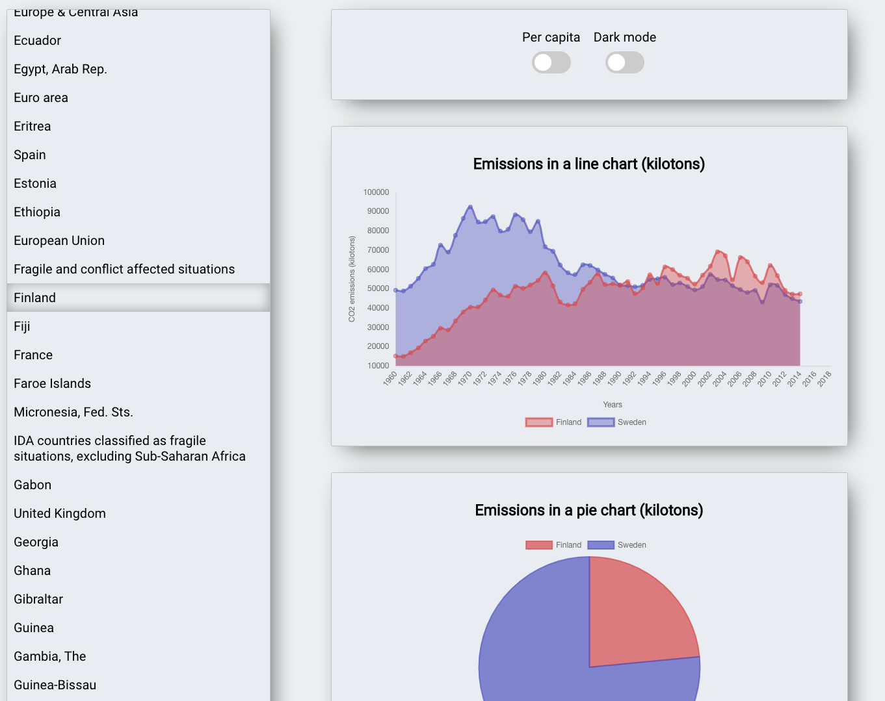

# CO2-emissions

## Preview:

## How to run on localhost
1. Clone this repository to your machine
2. cd co2-app
3. npm install
4. Open a new terminal in co2-app
5. cd Client
6. npm install
8. node index (1st terminal)
9. npm start (2nd terminal)

Backend: Node.js (backend wasn't really needed but I created it anyway)
Frontend: React

## How to use?
You can select different countries and view their CO2-emissions per year.
You can add multiple countries.
You can switch to "per capita" mode.
You can switch to "Dark mode".
If some country fails to load it's because of API (WorldBank) is not providing data for that specific country.

## Why this kind of app?
1. To demonstrate my skills
2. To learn
